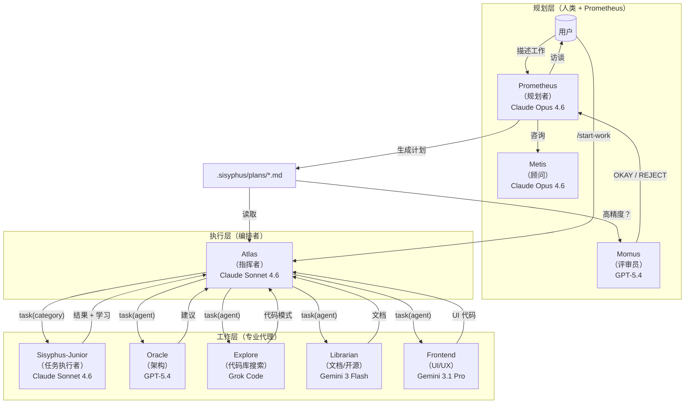
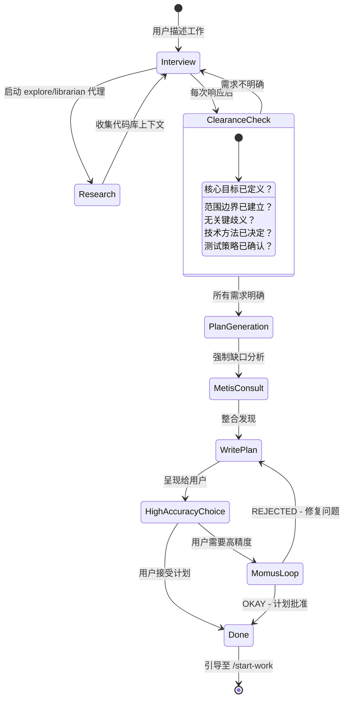
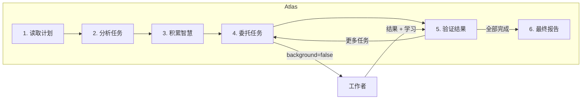

# 编排系统指南

## 架构

编排系统采用三层架构，通过专业化和委托解决上下文过载、认知漂移和验证缺口问题。



---

## 规划：Prometheus + Metis + Momus

### Prometheus：您的战略顾问

Prometheus 不仅是一个规划者，更是一个智能访谈者，帮助您思考实际需求。它是**只读的** - 只能创建或修改 `.sisyphus/` 目录内的 markdown 文件。

**访谈流程：**



**意图特定策略：**

Prometheus 根据您的工作内容调整其访谈风格：

| 意图                 | Prometheus 重点               | 示例问题                                                      |
| -------------------- | ----------------------------- | ------------------------------------------------------------ |
| **重构**             | 安全性 - 行为保留             | "哪些测试验证当前行为？" "回滚策略？"                       |
| **从零构建**         | 发现 - 模式优先               | "在代码库中发现模式 X。遵循它还是偏离？"                     |
| **中等规模任务**     | 护栏 - 精确边界               | "什么绝对不能包含？硬性约束？"                               |
| **架构**             | 战略性 - 长期影响             | "预期寿命？规模要求？"                                       |

### Metis：缺口分析器

在 Prometheus 编写计划之前，Metis 会捕捉 Prometheus 遗漏的内容：

- 用户请求中的隐藏意图
- 可能破坏实施的歧义
- AI 冗余模式（过度工程、范围蔓延）
- 缺失的验收标准
- 未处理的边缘情况

**为什么需要 Metis：**

计划作者（Prometheus）具有"ADHD 工作记忆" - 它建立的连接永远不会体现在页面上。Metis 强制将隐式知识外化。

### Momus：无情的评审员

对于高精度模式，Momus 根据四个核心标准验证计划：

1. **清晰度**：每个任务是否指定了在哪里找到实现细节？
2. **可验证性**：验收标准是否具体且可测量？
3. **上下文**：是否有足够的上下文继续进行而无需 >10% 的猜测？
4. **大局观**：目的、背景和工作流程是否清晰？

**Momus 循环：**

Momus 仅在以下情况下说"OKAY"：

- 100% 的文件引用已验证
- ≥80% 的任务有清晰的参考来源
- ≥90% 的任务有具体的验收标准
- 零任务需要对业务逻辑进行假设
- 零关键红旗

如果 REJECTED，Prometheus 会修复问题并重新提交。无最大重试限制。

---

## 执行：Atlas

### 指挥者思维

Atlas 就像交响乐指挥：它不演奏乐器，而是确保完美的和谐。



**Atlas 可以做什么：**

- 读取文件以理解上下文
- 运行命令以验证结果
- 使用 lsp_diagnostics 检查错误
- 使用 grep/glob/ast-grep 搜索模式

**Atlas 必须委托什么：**

- 编写或编辑代码文件
- 修复错误
- 创建测试
- Git 提交

### 智慧积累

编排的力量在于累积学习。每个任务后：

1. 从子代理的响应中提取学习内容
2. 分类为：约定、成功、失败、陷阱、命令
3. 传递给所有后续子代理

这防止重复错误并确保一致的模式。

**记事本系统：**

```
.sisyphus/notepads/{计划名称}/
├── learnings.md      # 模式、约定、成功方法
├── decisions.md      # 架构选择和理由
├── issues.md         # 遇到的问题、障碍、陷阱
├── verification.md   # 测试结果、验证结果
└── problems.md       # 未解决的问题、技术债务
```

---

## 工作者：Sisyphus-Junior 和专家

### Sisyphus-Junior：任务执行者

Junior 是实际编写代码的主力。关键特征：

- **专注**：无法委托（被 task 工具阻止）
- **纪律严明**：强迫性的待办事项跟踪
- **已验证**：完成前必须通过 lsp_diagnostics
- **受约束**：无法修改计划文件（只读）

**为什么 Sonnet 足够：**

Junior 不需要最聪明 - 它需要可靠。通过：

1. Atlas 的详细提示（50-200 行）
2. 传递的累积智慧
3. 清晰的 MUST DO / MUST NOT DO 约束
4. 验证要求

即使是中等模型也能精确执行。智能在于**系统**，而非单个代理。

### 系统提醒机制

钩子系统确保 Junior 永远不会中途停止：

```
[SYSTEM REMINDER - TODO CONTINUATION]

您有待办事项未完成！在响应前完成所有：
- [ ] 实现用户服务 ← 进行中
- [ ] 添加验证
- [ ] 编写测试

在所有待办事项标记为完成前不要响应。
```

这种"推石头"机制就是为什么系统以 Sisyphus（西西弗斯）命名。

---

## 类别 + 技能系统

### 为什么类别具有革命性

**模型名称的问题：**

```typescript
// 旧：模型名称创建分布偏差
task({ agent: "gpt-5.4", prompt: "..." }); // 模型知道其局限性
task({ agent: "claude-opus-4.6", prompt: "..." }); // 不同的自我认知
```

**解决方案：语义类别：**

```typescript
// 新：类别描述意图，而非实现
task({ category: "ultrabrain", prompt: "..." }); // "战略性思考"
task({ category: "visual-engineering", prompt: "..." }); // "精美设计"
task({ category: "quick", prompt: "..." }); // "快速完成"
```

### 内置类别

| 类别                 | 模型                     | 何时使用                                                 |
| -------------------- | ------------------------ | ------------------------------------------------------- |
| `visual-engineering` | Gemini 3.1 Pro           | 前端、UI/UX、设计、样式、动画                           |
| `ultrabrain`         | GPT-5.4 (xhigh)          | 深度逻辑推理、复杂架构决策                              |
| `artistry`           | Gemini 3.1 Pro (high)    | 高度创造性或艺术性任务、新颖想法                        |
| `quick`              | Claude Haiku 4.5         | 琐碎任务 - 单文件更改、拼写错误修复                     |
| `deep`               | GPT-5.3 Codex (medium)   | 目标导向的自主问题解决、深入研究                        |
| `unspecified-low`    | Claude Sonnet 4.6        | 不适合其他类别的任务，低工作量                          |
| `unspecified-high`   | Claude Opus 4.6 (max)    | 不适合其他类别的任务，高工作量                          |
| `writing`            | Gemini 3 Flash           | 文档、散文、技术写作                                    |

### 技能：领域特定指令

技能将专业指令预置到子代理提示中：

```typescript
// 类别 + 技能组合
task(
  category = "visual-engineering",
  load_skills = ["frontend-ui-ux"], // 添加 UI/UX 专业知识
  prompt = "...",
);

task(
  category = "general",
  load_skills = ["playwright"], // 添加浏览器自动化专业知识
  prompt = "...",
);
```

---

## 使用模式

### 如何调用 Prometheus

**方法 1：切换到 Prometheus 代理（Tab → 选择 Prometheus）**

```
1. 在提示符处按 Tab
2. 从代理列表中选择 "Prometheus"
3. 描述您的工作："我想重构认证系统"
4. 回答访谈问题
5. Prometheus 在 .sisyphus/plans/{名称}.md 中创建计划
```

**方法 2：使用 @plan 命令（在 Sisyphus 中）**

```
1. 保持在 Sisyphus（默认代理）
2. 输入：@plan "我想重构认证系统"
3. @plan 命令自动切换到 Prometheus
4. 回答访谈问题
5. Prometheus 在 .sisyphus/plans/{名称}.md 中创建计划
```

**您应该使用哪种方法？**

| 场景                          | 推荐方法               | 为什么                                                  |
| ----------------------------- | ---------------------- | ------------------------------------------------------ |
| **新会话，从头开始**          | 切换到 Prometheus 代理 | 清晰的心智模型 - 您正在进入"规划模式"                  |
| **已在 Sisyphus 中，工作中**  | 使用 @plan             | 方便，无需切换代理                                     |
| **需要显式控制**              | 切换到 Prometheus 代理 | 清晰的规划与执行上下文分离                             |
| **快速规划中断**              | 使用 @plan             | 从当前上下文的最快路径                                 |

两种方法都触发相同的 Prometheus 规划流程。@plan 命令只是一个方便的快捷方式。

### /start-work 行为和会话连续性

**运行 /start-work 时会发生什么：**

```
用户：/start-work
    ↓
[start-work 钩子激活]
    ↓
检查：.sisyphus/boulder.json 是否存在？
    ↓
    ├─ 是（现有工作）→ 恢复模式
    │   - 读取现有的 boulder 状态
    │   - 计算进度（已勾选 vs 未勾选的复选框）
    │   - 注入包含剩余任务的继续提示
    │   - Atlas 从您离开的地方继续
    │
    └─ 否（全新开始）→ 初始化模式
        - 在 .sisyphus/plans/ 中找到最新计划
        - 创建新的 boulder.json 跟踪此计划
        - 将会话代理切换到 Atlas
        - 从任务 1 开始执行
```

**会话连续性解释：**

`boulder.json` 文件跟踪：

- **active_plan**：当前计划文件的路径
- **session_ids**：所有在此计划上工作的会话
- **started_at**：工作开始时间
- **plan_name**：人类可读的计划标识符

**示例时间线：**

```
星期一 9:00 AM
  └─ @plan "构建用户认证"
  └─ Prometheus 访谈并创建计划
  └─ 用户：/start-work
  └─ Atlas 开始执行，创建 boulder.json
  └─ 任务 1 完成，任务 2 进行中...
  └─ [会话结束 - 计算机崩溃、用户注销等]

星期一 2:00 PM（新会话）
  └─ 用户打开新会话（默认代理 = Sisyphus）
  └─ 用户：/start-work
  └─ [start-work 钩子读取 boulder.json]
  └─ "恢复'构建用户认证' - 8 个任务中的 3 个已完成"
  └─ Atlas 从任务 3 继续（无上下文丢失）
```

当您运行 `/start-work` 时，Atlas 会自动激活。您不需要手动切换到 Atlas。

### Hephaestus vs Sisyphus + ultrawork

**快速比较：**

| 方面          | Hephaestus                                 | Sisyphus + `ulw` / `ultrawork`                       |
| ------------- | ------------------------------------------ | ---------------------------------------------------- |
| **模型**      | GPT-5.3 Codex（中等推理）                  | Claude Opus 4.6 / GPT-5.4 / GLM 5 取决于设置         |
| **方法**      | 自主深度工作者                             | 关键字激活的 ultrawork 模式                          |
| **最适合**    | 复杂架构工作、深度推理                     | 一般复杂任务、"直接做"场景                           |
| **规划**      | 执行期间自我规划                           | 如果可用则使用 Prometheus 计划                       |
| **委托**      | 大量使用 explore/librarian 代理            | 使用基于类别的委托                                   |
| **温度**      | 0.1                                        | 0.1                                                  |

**何时使用 Hephaestus：**

切换到 Hephaestus（Tab → 选择 Hephaestus）当：

1. **需要深度架构推理**
   - "设计新的插件系统"
   - "将此单体重构为微服务"

2. **需要推理链的复杂调试**
   - "为什么这个竞态条件只在星期二发生？"
   - "通过 15 个文件追踪此内存泄漏"

3. **跨领域知识综合**
   - "将我们的 Rust 核心与 TypeScript 前端集成"
   - "从 MongoDB 迁移到 PostgreSQL，零停机时间"

4. **您特别需要 GPT-5.3 Codex 的推理风格**
   - 某些问题受益于 GPT-5.3 Codex 的训练特性

**何时使用 Sisyphus + `ulw`：**

在 Sisyphus 中使用 `ulw` 关键字当：

1. **您希望代理自行解决**
   - "ulw 修复失败的测试"
   - "ulw 为 API 添加输入验证"

2. **复杂但范围明确的任务**
   - "ulw 按照我们的模式实现 JWT 认证"
   - "ulw 为部署创建新的 CLI 命令"

3. **您感到懒惰**（官方支持的使用场景）
   - 不想编写详细需求
   - 信任代理探索和决定

4. **您希望利用现有计划**
   - 如果存在 Prometheus 计划，`ulw` 模式可以使用它
   - 如果没有计划，则回退到自主探索

**推荐：**

- **对于大多数用户**：在 Sisyphus 中使用 `ulw` 关键字。这是默认路径，适用于 90% 的复杂任务。
- **对于高级用户**：当您特别需要 GPT-5.3 Codex 的推理风格或想要"完全自主探索和执行"的体验时，切换到 Hephaestus。

---

## 配置

您可以在 `oh-my-opencode.json` 中控制相关功能：

```jsonc
{
  "sisyphus_agent": {
    "disabled": false, // 启用 Atlas 编排（默认：false）
    "planner_enabled": true, // 启用 Prometheus（默认：true）
    "replace_plan": true, // 用 Prometheus 替换默认计划代理（默认：true）
  },

  // 钩子设置（添加以禁用）
  "disabled_hooks": [
    // "start-work",             // 禁用执行触发器
    // "prometheus-md-only"      // 移除 Prometheus 写入限制（不推荐）
  ],
}
```

---

## 故障排除

### "我切换到 Prometheus 但什么都没发生"

Prometheus 默认进入访谈模式。它会询问您关于需求的问题。回答它们，然后在准备好时说"make it a plan"。

### "/start-work 说'未找到活动计划'"

要么：

- `.sisyphus/plans/` 中没有计划 → 首先使用 Prometheus 创建一个
- 存在计划但 boulder.json 指向其他地方 → 删除 `.sisyphus/boulder.json` 并重试

### "我在 Atlas 中但想切换回正常模式"

输入 `exit` 或开始新会话。Atlas 主要通过 `/start-work` 进入 - 您通常不会手动"切换到 Atlas"。

### "@plan 和直接切换到 Prometheus 有什么区别？"

**功能上没有区别。** 两者都调用 Prometheus。@plan 是一个方便的命令，而切换代理是显式控制。使用您觉得自然的方式。

### "我应该使用 Hephaestus 还是输入 ulw？"

**对于大多数任务**：在 Sisyphus 中输入 `ulw`。

**使用 Hephaestus 当**：您特别需要 GPT-5.3 Codex 的推理风格进行深度架构工作或复杂调试。

---

## 进一步阅读

- [概述](./overview.zh-CN.md)
- [功能参考](../reference/features.zh-CN.md)
- [配置参考](../reference/configuration.zh-CN.md)
- [宣言](../manifesto.zh-CN.md)